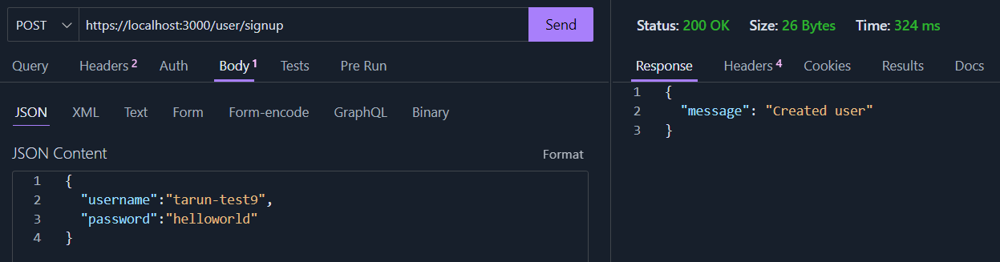

# NotesAPI

This project implements the backend functionality for a simplistic notes app. The purpose of this project is to showcase my Go API development skills using the GO-Fiber framework. This API implements the basic CRUD (Create, Read, Update, Delete) functionality, and MongoDB is used as our database to store the notes. We use Postgres (supabase) to store user information, such as usernames and passwords. Additionally, JWTs are used for authentication.

***

The API also provides registration and login functionality; users must register and log in before they can start performing tasks related to notes. Each note-related action requires the user to present a valid JWT token. To acquire a valid JWT token, the user must provide a valid username and password that they used during the signup process. User-related information is stored in a Postgres database, whereas the notes generated by users are stored in MongoDB.


## Features

The API provides fundamental user-related features such as user creation and login, as well as note-related features including creating a new note, reading all of a user's notes, searching for notes by name, and updating and deleting notes.

#### User Features

1. Signup: An anonymous user can provide a username and password to create a new account. Afterward, the user can log in and utilize the API
2. Login: A user can log in using the credentials provided during the signup process. If successful, the user will receive an authentication token, which can be used to access the notes functionality&#x20;
3. Validate Token: This is mainly a debugging functionality, it can also help users verify the validity of their tokens. This function checks the supplied auth token's validity and returns the username associated with it

#### Notes Features

1. Create Note: The user can create a note by just providing the note title, note content and a note associated with the user will be created
2. Get all notes/Get note by name: Using this the user can view all notes associated with them and also search for notes using their title
3. Update a Note: Users can update the title or content of a note by providing the note's ID
4. Delete a Note: Users can delete a specific note by providing its ID

For both delete and update, the note object must be associated with the requesting user.&#x20;


## Installation

### .env

Create a .env file in the project directory

```
// ENV variables
POSTGRES_CONN = <connection string postgres>
PORT = 3000    //can be changed
JWT_SECRET = <jwt signing secret>
MONGO_CONN = <connection string mongo>
```

### TLS Certs

Create a directory with the necessary TLS certs needed to serve the api over https. Based on the deployment conditions we can also use a self-signed cert here, the steps involved in generating can be seen here :- [https://github.com/ChristianLempa/cheat-sheets/blob/main/misc/ssl-certs.md](https://github.com/ChristianLempa/cheat-sheets/blob/main/misc/ssl-certs.md)

```
.
├── certs
│   ├── cert-key.pem
│   └── fullChain.pem
```


### Docker

This is the easiest way to install the application.&#x20;

Execute the following commands,

Build the docker image,

```bash
docker build --pull --rm -f "Dockerfile" -t notesapi "."
```

Once the image is built run the container using,


```bash
docker run -d -p 3000:3000 --name notes-container notesapi
```

Refer to this for an in-depth explanation of the containerization process :- [https://docs.docker.com/get-started/02\_our\_app/](https://docs.docker.com/get-started/02\_our\_app/)

The port numbers, and other options can be modified here. Make sure the modification reflect in the application as well(env file).


Also in our project directory, we have tow dockerfiles,

```
.
├── Dockerfile
├── Dockerfile-singleStage
```

`Dockerfile` :- Follows a multi stage build process

`Dockerfile-singleStage` :- Follows a single stage build process

The reason we use a multi stage build is to reduce the size of the image generated. \
Single stage builds are faster and simpler, multi stage builds offer a considerably smaller image size, and improved maintainability for larger and more complex projects.&#x20;

Reference: [https://docs.docker.com/build/building/multi-stage/#use-multi-stage-builds](https://docs.docker.com/build/building/multi-stage/#use-multi-stage-builds)

### Build using GO

Navigate to the application directory and perform,

```bash
//download all dependencies
go mod download

//build the application
go build

//run the app
go run .
```


## Directory tree

```
.
├── .env                      /environment variables 
├── Dockerfile                //multistage build dockerfile
├── Dockerfile-singleStage    //singlestage build dockerfile
├── certs                    
│   ├── cert-key.pem          //TLS Cert private key (keep secure)
│   └── fullChain.pem         //TLS Cert
├── go.mod
├── go.sum
├── handlers
│   ├── authHandlers.go       //Handler functions for auth and user
│   └── notesHandler.go       //Handler functions for notes
├── initializers              //Env setup functions
│   ├── loadDB.go
│   ├── loadEnv.go
│   └── migrateUserDB.go
├── main.go                    //main file
├── middleware
│   ├── authMiddleware.go     //JWT auth middleware
│   ├── helmetConfig.go       //helmet config (security headers)
│   └── rateLimiter.go        //rate limiting middleware
├── models                    //Data models
│   ├── notes.go
│   └── user.go
├── routes                    //Fiber API route definitions
│   ├── auth.go
│   └── noteOperation.go
```


## API Usage/Endpoint Information

### Auth/User Endpoints

1.  **/user/signup :-** This is a POST endpoint. It takes `username`,`password` as body parameters and returns whether user creation was sucesfull or not

    <figure><figcaption></figcaption></figure>
2.  **/user/login :-** This is a POST endpoint. It takes `username`, `password` as body parameters and returns a secure auth cookie if successful else an error message is returned

    <figure><figcaption></figcaption></figure>
3.  **/user/validateToken :-** This is a GET endpoint. It takes the auth cookie and verifies it's validity and returns the associated username

    <figure><figcaption></figcaption></figure>

### Notes Endpoints

1.  **/notes/ :-** A POST request to this endpoint can be used to create a new note

    <figure><figcaption></figcaption></figure>
2.  **/notes/ :-** A GET request to this endpoint sends back all the notes associated with a user&#x20;

    <figure><figcaption></figcaption></figure>
3.  **/notes/:title :-** A GET request to this endpoint with the title name specified would return the associated note

    <figure><figcaption></figcaption></figure>
4.  **/notes/:id** :- A PUT request to this endpoint with the note id specified can be used to update the note

    <figure><figcaption></figcaption></figure>


5.  **/notes/:id** :- A DELETE request to this endpoint with the note id specified can be used to delete the note

    <figure><figcaption></figcaption></figure>

***

Also for self-signed certs to work you must install the CA certificate in your local machine/client's root store.&#x20;

Steps: [https://github.com/ChristianLempa/cheat-sheets/blob/main/misc/ssl-certs.md#install-the-ca-cert-as-a-trusted-root-ca](https://github.com/ChristianLempa/cheat-sheets/blob/main/misc/ssl-certs.md#install-the-ca-cert-as-a-trusted-root-ca)

Also CA certs can also be added to Postman while testing.

## Data Models Implemented

#### User Model

The user data is stored in Postgres, which is a SQL DB and we utilize gorm to interact with it.&#x20;

The user model we use is simplistic and straightforward,

```go
type User struct {
	gorm.Model
	Username 		string `gorm:"unique"`
	Password 		string
  }
```

The usage of `gorm.Model` automatically implements columns like ID, CreatedAt and so on.

The above model equals,

```go
type User struct {
	  ID        uint               `gorm:"primaryKey"`
    	  CreatedAt time.Time
  	  UpdatedAt time.Time
  	  DeletedAt gorm.DeletedAt     `gorm:"index"`
	  Username 		string `gorm:"unique"`
	  Password 		string
  }
```


#### Notes Model

We store our notes using Mongo. As a more flexible data store would be beneficial for storing notes.

To interact with Mongo we use the official Mongo go-drivers,

```go
type Note struct {
	ID      string 		`json:"id" bson:"_id"`
	UserID  string 		`json:"userId" bson:"userId"`
	Author	string		`json:"author" bson:"author"`
	Title   string 		`json:"title" bson:"title"`
	Content string 		`json:"content" bson:"content"`
}
```


## Rate Limiting

Added rate limiting for both User related endpoints and Notes related. Different api rates are employed Auth and Notes functionalities.&#x20;

```go
//rate limiter config for Auth functions
var AuthRateConfig = limiter.Config{
	Max: 		20,
	Expiration: 30 * time.Second,
	LimiterMiddleware: limiter.SlidingWindow{},
	LimitReached: rateLimitExceeded,
}

//rate limiter config for notes endpoint
var NotesRateConfig = limiter.Config{
	Max: 		45,
	Expiration: 30 * time.Second,
	LimiterMiddleware: limiter.SlidingWindow{},
	LimitReached: rateLimitExceeded,
}
```

The rates can be increased and decreased based on requirements.

## Cookies

For authentication we use a signed JWT that is stored as an Auth cookie. The JWT token is signed using `HS256` .  Also we encrypt the cookies using the `encryptcookie` middleware,

```go
app.Use(encryptcookie.New(encryptcookie.Config{
		Key: os.Getenv("COOKIE_ENC_SECRET"),
	}))
```

***

Also `helmet` middleware is used to add security headers to our API responses.&#x20;
